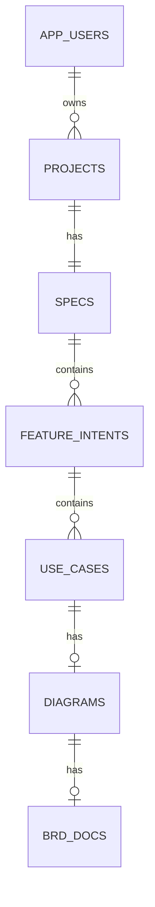

# Database Architecture

## 1. Mục tiêu MVP

Database chỉ lưu phiên bản mới nhất của chuỗi:

`AppUser -> Project -> Spec -> FeatureIntent -> UseCase -> Diagram -> BrdDoc`

Phạm vi:

- `app_user` có role `user` hoặc `admin`.
- User đăng ký/đăng nhập bình thường luôn có role `user`.
- Role `admin` chỉ được chuẩn bị trong schema, chưa có chức năng quản trị.
- Một user có nhiều project.
- Một project có đúng một spec.
- Một spec có nhiều feature intent.
- Một feature intent có nhiều use case.
- Một use case có tối đa một diagram.
- Một diagram có tối đa một BRD document.
- Không có revision history, workspace, audit hoặc realtime trong MVP.
- User bấm `Lưu` để ghi đè phiên bản mới nhất của từng phần.

## 2. Quyết định kỹ thuật

| Hạng mục | Quyết định |
| --- | --- |
| Database | PostgreSQL |
| Backend | FastAPI hiện có trong `apps/api` |
| ORM / migration | SQLAlchemy 2.x + Alembic |
| Authentication | Clerk JWT |
| Authorization | Project thuộc trực tiếp một `app_user` |
| Versioning | Không có; chỉ giữ bản mới nhất |
| Save behavior | Explicit `Lưu`; không autosave |
| Structured content | JSONB cho schema nghiệp vụ và LogicFlow graph |
| Admin | Chỉ có role trong database, chưa có màn hình/API quản trị |

### 2.1. Runtime database connection

Backend dùng SQLAlchemy 2.x dạng synchronous với `psycopg` để khớp các FastAPI route hiện tại.

| Runtime | Biến dùng | Yêu cầu |
| --- | --- | --- |
| Local chạy trực tiếp | `DATABASE_URL` là public TCP proxy URL đã resolve | Không dùng hostname `*.railway.internal`; bật `sslmode=require` |
| Local qua Railway CLI | `railway run ...` | Railway inject biến đã resolve |
| API deploy trên Railway | `DATABASE_URL=${{Postgres.DATABASE_URL}}` | API và Postgres phải cùng project/environment; dùng private network |
| Migration pre-deploy | Cùng `DATABASE_URL` của API service | Chạy `alembic upgrade head` trước khi start app |

`DATABASE_PUBLIC_URL` là thông tin kết nối ngoài Railway. Application code chỉ đọc một canonical
`DATABASE_URL`; không thêm nhánh runtime tự chọn public/private URL.

Các biến vận hành Postgres như `PGDATA`, `POSTGRES_USER`, `POSTGRES_PASSWORD`, `SSL_CERT_DAYS` thuộc
Postgres service, không phải contract cấu hình của FastAPI service.

Railway reference syntax `${{ ... }}` chỉ được resolve trong Railway Variables hoặc lệnh
`railway run`. File loader hiện tại trong `apps/api/app/config.py` không interpolate syntax này, nên
không được copy reference chưa resolve vào `.env` rồi chạy `npm run dev:api`.

### 2.2. Credential policy

- Không commit `.env`; repo hiện ignore file này.
- Nếu password xuất hiện trong chat, log, ticket hoặc screenshot, phải rotate ngay.
- Sau khi rotate, redeploy mọi service phụ thuộc vào URL/password cũ.
- `.env.example` chỉ chứa tên biến và placeholder, không chứa host/user/password thật.
- Không log connection URL; error logging phải redact credential.

## 3. ERD



Ràng buộc:

- `projects.app_user_id`: user 1-n project.
- `specs.project_id unique`: project 1-1 spec.
- `feature_intents.spec_id`: spec 1-n feature intent.
- `use_cases.feature_intent_id`: feature intent 1-n use case.
- `diagrams.use_case_id unique`: use case 1-0..1 diagram.
- `brd_docs.diagram_id unique`: diagram 1-0..1 BRD.

## 4. Thiết kế bảng

### 4.1. `app_users`

| Cột | Kiểu | Ràng buộc / ghi chú |
| --- | --- | --- |
| `id` | uuid | PK |
| `clerk_user_id` | varchar(255) | Unique, not null |
| `email` | varchar(320) | Nullable |
| `display_name` | varchar(255) | Nullable |
| `role` | varchar(20) | Not null, default `user` |
| `created_at` | timestamptz | Default `now()` |
| `updated_at` | timestamptz | Default `now()` |

```sql
check (role in ('user', 'admin'))
```

Quy tắc:

- User mới luôn được tạo với `role='user'`.
- Client không được gửi hoặc sửa role.
- Không lưu password, Clerk session token hoặc JWT.
- Việc cấp role `admin` để migration/công cụ quản trị tương lai xử lý.

### 4.2. `projects`

| Cột | Kiểu | Ràng buộc / ghi chú |
| --- | --- | --- |
| `id` | uuid | PK |
| `app_user_id` | uuid | FK `app_users.id`, not null |
| `name` | varchar(255) | Not null |
| `description` | text | Nullable |
| `created_at` | timestamptz | Default `now()` |
| `updated_at` | timestamptz | Default `now()` |

```sql
create index idx_projects_app_user_updated
  on projects (app_user_id, updated_at desc);
```

User chỉ được CRUD project của chính mình. Role `admin` chưa có quyền đặc biệt trong MVP.

### 4.3. `specs`

`Spec` chính là **Bối cảnh dự án / ProjectSpec** hiện tại trên UI.

| Cột | Kiểu | Ràng buộc / ghi chú |
| --- | --- | --- |
| `id` | uuid | PK |
| `project_id` | uuid | FK `projects.id`, unique, not null |
| `project_summary` | text | Not null, default `''` |
| `business_context` | text | Nullable |
| `target_users` | jsonb | Array string, default `[]` |
| `business_rules` | jsonb | Array string, default `[]` |
| `glossary` | jsonb | Array string, default `[]` |
| `created_at` | timestamptz | Default `now()` |
| `updated_at` | timestamptz | Default `now()` |

Không lưu `project_name` trong `specs`.

Canonical `ProjectSpec` cho generation:

```text
ProjectSpec.project_name     <- projects.name
ProjectSpec.project_summary  <- specs.project_summary
ProjectSpec.business_context <- specs.business_context
ProjectSpec.target_users     <- specs.target_users
ProjectSpec.business_rules   <- specs.business_rules
ProjectSpec.glossary         <- specs.glossary
```

Tên project được chuyển khỏi form ProjectSpec sang entity/header Project.

### 4.4. `feature_intents`

| Cột | Kiểu | Ràng buộc / ghi chú |
| --- | --- | --- |
| `id` | uuid | PK |
| `spec_id` | uuid | FK `specs.id`, not null |
| `name` | varchar(255) | Not null; map `feature_name` |
| `feature_summary` | text | Not null |
| `actors` | jsonb | Danh sách actor/swimlane của riêng feature |
| `trigger` | text | Nullable |
| `inputs` | jsonb | Array string |
| `outputs` | jsonb | Array string |
| `constraints` | jsonb | Array string |
| `assumptions` | jsonb | Array string |
| `systems_involved` | jsonb | Array string |
| `success_outcome` | text | Nullable |
| `created_at` | timestamptz | Default `now()` |
| `updated_at` | timestamptz | Default `now()` |

```sql
create index idx_feature_intents_spec_updated
  on feature_intents (spec_id, updated_at desc);
```

Không cần `function_name` riêng trong database MVP; `name` là tên chức năng canonical.

`specs.target_users` là nhóm người dùng nền của toàn dự án. `feature_intents.actors` là các actor
tham gia trực tiếp vào chức năng cụ thể. UI không được tiếp tục ghi actors của feature vào
`ProjectSpec.target_users` như flow hiện tại.

Trong giai đoạn backend schema cũ còn dùng `primary_actor`:

```text
FeatureIntent.primary_actor   <- actors[0]
FeatureIntent.systems_involved giữ danh sách system riêng
```

Sau đó nên nâng contract `FeatureIntent` thành first-class `actors: string[]`.

### 4.5. `use_cases`

Mỗi row lưu `UseCaseDraft` mới nhất.

| Cột | Kiểu | Ràng buộc / ghi chú |
| --- | --- | --- |
| `id` | uuid | PK |
| `feature_intent_id` | uuid | FK `feature_intents.id`, not null |
| `use_case_key` | varchar(100) | Ví dụ `UC-01` |
| `title` | varchar(255) | Not null |
| `content` | jsonb | Canonical `UseCaseDraft` |
| `review_status` | varchar(20) | `draft`, `reviewed`, `approved` |
| `created_at` | timestamptz | Default `now()` |
| `updated_at` | timestamptz | Default `now()` |

```sql
unique (feature_intent_id, use_case_key)
```

`content` giữ objective, actors, preconditions, steps, alternate flows, outcome và stable IDs.
Backend phải bảo đảm `title`, `use_case_key`, `review_status` khớp với `content`.

Bulk save:

1. Upsert theo `(feature_intent_id, use_case_key)`.
2. Update row hiện có bằng nội dung mới nhất.
3. Chỉ xóa use case không còn trong danh sách sau confirm rõ trên UI.
4. Generate không đồng nghĩa với Save.

### 4.6. `diagrams`

| Cột | Kiểu | Ràng buộc / ghi chú |
| --- | --- | --- |
| `id` | uuid | PK |
| `use_case_id` | uuid | FK `use_cases.id`, unique, not null |
| `title` | varchar(255) | Not null |
| `graph_data` | jsonb | LogicFlow nodes và edges |
| `lanes_data` | jsonb | Lane config/order/width |
| `lane_height` | integer | Not null |
| `source_use_case_updated_at` | timestamptz | Dùng báo outdated |
| `semantic_edited` | boolean | Default false |
| `created_at` | timestamptz | Default `now()` |
| `updated_at` | timestamptz | Default `now()` |

`graph_data` giữ node/edge properties, lane binding, sizing, sync-bar span, trace và provenance.

```text
outdated = diagrams.source_use_case_updated_at < use_cases.updated_at
diverged = diagrams.semantic_edited = true
```

Đây chỉ là UX indicator; không có revision/merge trong MVP.

### 4.7. `brd_docs`

| Cột | Kiểu | Ràng buộc / ghi chú |
| --- | --- | --- |
| `id` | uuid | PK |
| `diagram_id` | uuid | FK `diagrams.id`, unique, not null |
| `title` | varchar(255) | Not null |
| `structured_spec` | jsonb | `BrdSpec` mới nhất |
| `markdown_content` | text | Bản user đang chỉnh |
| `warnings` | jsonb | Warning mới nhất |
| `template` | varchar(20) | `default` hoặc `full` |
| `source_diagram_updated_at` | timestamptz | Dùng báo outdated |
| `created_at` | timestamptz | Default `now()` |
| `updated_at` | timestamptz | Default `now()` |

```text
brd_outdated = brd_docs.source_diagram_updated_at < diagrams.updated_at
```

`Lưu BRD` ghi đè nội dung trước. Không có lịch sử.

## 5. Delete và latest-state policy

MVP dùng cascade:

```text
app_users
  -> projects
  -> specs
  -> feature_intents
  -> use_cases
  -> diagrams
  -> brd_docs
```

- `PUT`/upsert ghi đè row hiện tại.
- `updated_at` cập nhật trên mọi lần Save.
- Không lưu snapshot cũ.
- UI phải confirm trước khi xóa project, feature intent hoặc use case.

## 6. API tối thiểu

### User

```text
GET /api/me
```

Backend verify Clerk JWT và tự tạo `app_users(role='user')` nếu chưa tồn tại.

### Project và Spec

```text
POST   /api/projects
GET    /api/projects
GET    /api/projects/{project_id}
PUT    /api/projects/{project_id}
DELETE /api/projects/{project_id}

GET /api/projects/{project_id}/spec
PUT /api/projects/{project_id}/spec
```

`POST /api/projects` tạo luôn row `specs` rỗng/default trong cùng transaction.

### FeatureIntent

```text
POST   /api/specs/{spec_id}/feature-intents
GET    /api/specs/{spec_id}/feature-intents
GET    /api/feature-intents/{feature_intent_id}
PUT    /api/feature-intents/{feature_intent_id}
DELETE /api/feature-intents/{feature_intent_id}
```

### UseCase

```text
GET /api/feature-intents/{feature_intent_id}/use-cases
PUT /api/feature-intents/{feature_intent_id}/use-cases
DELETE /api/use-cases/{use_case_id}
```

Bulk `PUT` khớp UI hiện tại. Sau generate, user bấm `Lưu danh sách use case`.
Bulk `PUT` chỉ upsert các item trong payload; không xóa ngầm item bị thiếu. Xóa dùng endpoint riêng
sau khi user confirm.

Resource trả về tách database identity khỏi business key:

```text
UseCaseResource.id                 <- use_cases.id (uuid)
UseCaseResource.use_case_key       <- use_cases.use_case_key, ví dụ UC-01
UseCaseResource.content.use_case_id <- use_cases.use_case_key
```

Diagram và BRD luôn dùng UUID database để làm FK; label `UC-01` không được dùng làm FK.

### Diagram

```text
GET    /api/use-cases/{use_case_id}/diagram
PUT    /api/use-cases/{use_case_id}/diagram
DELETE /api/use-cases/{use_case_id}/diagram
```

### BRD

```text
GET    /api/diagrams/{diagram_id}/brd
PUT    /api/diagrams/{diagram_id}/brd
DELETE /api/diagrams/{diagram_id}/brd
```

### Generation từ parent đã lưu

Generation không ghi database tự động, nhưng backend phải load và authorize parent đã lưu:

```text
POST /api/feature-intents/{feature_intent_id}/use-cases/generate
POST /api/use-cases/{use_case_id}/diagram/generate
POST /api/diagrams/{diagram_id}/brd/validate
POST /api/diagrams/{diagram_id}/brd/generate
```

- Use-case generation dựng `ProjectSpec` từ `projects + specs` và load `feature_intents`.
- Diagram generation load `use_cases.content` và yêu cầu `review_status='approved'`.
- BRD generation load diagram graph/lanes đã lưu.
- Response là draft để user review; chỉ nút `Lưu` tương ứng mới persist.
- Existing generation service được tái sử dụng; chỉ thay request boundary từ payload tùy ý sang
  resource ID đã authorize.

## 7. Flow UI/UX mới

### 7.1. Project dashboard

Sau đăng nhập, user vào:

- danh sách project của mình;
- nút `Tạo project`;
- tên project và thời gian cập nhật;
- click project để mở workspace;
- xóa project có confirm cascade.

Form tạo project:

- `Tên project` bắt buộc;
- `Mô tả ngắn` tùy chọn;
- action `Tạo project`.

### 7.2. Project header

Khi mở workspace:

- luôn hiển thị tên project đang mở;
- action `Đổi project`;
- action `Lưu project` khi metadata thay đổi;
- bỏ `Tên dự án` khỏi ProjectSpec.

### 7.3. Tách Spec khỏi FeatureIntent

Input workspace hiện đang trộn chức năng và bối cảnh. Flow mới:

1. `Bối cảnh dự án`
2. `Chức năng`
3. `Use cases`
4. `Sơ đồ`

#### Tab `Bối cảnh dự án`

Chỉ sửa `specs`:

- Mô tả bối cảnh;
- business context;
- target users/actors nền;
- business rules;
- glossary.

Action: `Lưu bối cảnh`.

#### Tab `Chức năng`

- Danh sách feature intent thuộc spec.
- `Thêm chức năng`.
- Chọn một feature để chỉnh tên, mô tả, actors/swimlanes, trigger, inputs/outputs,
  constraints và success outcome.
- `Lưu chức năng`.
- `Xóa chức năng` có confirm.
- `Sinh use case` chỉ hoạt động sau khi Spec và Feature hiện tại đã lưu.

### 7.4. Use-case Save

Sau generate/edit:

- badge `Chưa lưu` nếu khác dữ liệu đã load/save;
- action `Lưu danh sách use case`;
- `Phê duyệt` cập nhật local, sau đó Save persist toàn bộ;
- trước khi tạo diagram, use case phải approved và đã lưu.

### 7.5. Diagram Save

Toolbar canvas thêm `Lưu sơ đồ`.

Save:

- lấy `lf.getGraphData()`;
- lấy lane config và lane height;
- `PUT /api/use-cases/{id}/diagram`;
- ghi đè diagram mới nhất;
- hiển thị `Chưa lưu` sau mutation và `Đã lưu lúc HH:mm` sau success.

Khi rời canvas chưa lưu, UI phải confirm.

### 7.6. BRD Save

BRD panel thêm `Lưu BRD`.

Payload:

- structured spec;
- markdown user đã chỉnh;
- warnings;
- template;
- source diagram timestamp.

Sau khi diagram đổi, BRD hiển thị `Outdated` nhưng bản đã lưu vẫn mở được.
`localStorage` chỉ còn là recovery tạm; server là nguồn chính.

## 8. Save-state contract

Mỗi phần dùng:

```text
idle | dirty | saving | saved | failed
```

- Edit -> `dirty`.
- Click Save -> `saving`.
- API success -> cập nhật ID/snapshot và `saved`.
- API failure -> giữ dữ liệu local và `failed`.
- Generate không đồng nghĩa Save.
- Downstream CTA phải kiểm tra parent đã save.

| Scope | Nút |
| --- | --- |
| Project metadata | `Lưu project` |
| Spec | `Lưu bối cảnh` |
| Feature intent | `Lưu chức năng` |
| Use-case portfolio | `Lưu danh sách use case` |
| Diagram | `Lưu sơ đồ` |
| BRD | `Lưu BRD` |

## 9. Validation và bảo mật tối thiểu

1. Mọi endpoint verify Clerk JWT.
2. Backend resolve `app_user` từ JWT `sub`.
3. Mọi query kiểm ownership qua `projects.app_user_id`.
4. Role từ client bị bỏ qua.
5. User mới luôn role `user`.
6. JSONB validate bằng Pydantic schemas hiện có.
7. Giới hạn kích thước graph/BRD payload.
8. Không trả project của user khác dù biết UUID.
9. CORS cho frontend chính thức phải cho `Authorization`, `Content-Type`, `Idempotency-Key`,
   `X-Schema-Version` và methods `GET/POST/PUT/PATCH/DELETE/OPTIONS`.
10. Tất cả `/api/*` yêu cầu session token, ngoại trừ health/readiness endpoint.

## 10. Không làm trong MVP

- Workspace/team membership.
- Revision history, diff hoặc revert.
- Autosave và optimistic locking.
- Audit/share links/comments.
- Persist generation run/prompt/cost.
- Persistent idempotency.
- Admin dashboard.
- Realtime Yjs/CRDT.

## 11. Thứ tự triển khai

1. Rotate credential, chuẩn hóa Railway/local env và deploy contract.
2. PostgreSQL/SQLAlchemy/Alembic.
3. Clerk JWT, CORS và `app_users`.
4. Shared ownership/repository/API contract.
5. Frontend authenticated API client, protected routing và project dashboard.
6. Project/Spec backend + frontend.
7. FeatureIntent backend + frontend.
8. UseCase generation/persistence backend + frontend.
9. Diagram generation/persistence backend + frontend.
10. BRD generation/persistence backend + frontend.
11. Dirty-state, navigation guard, Railway migration/release và E2E full reload.
